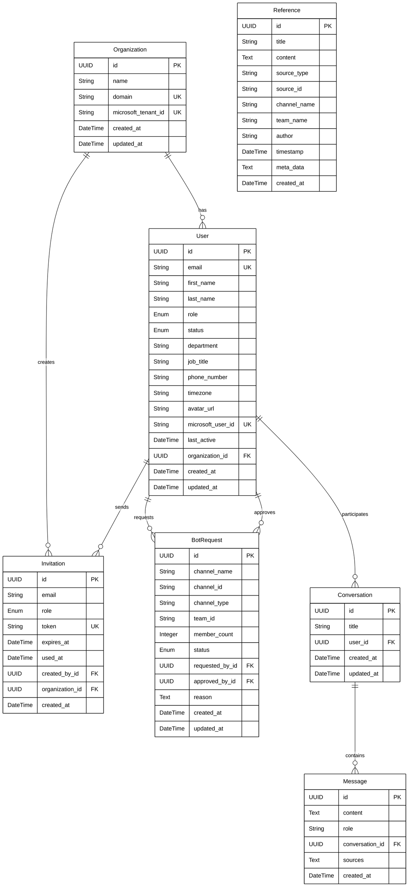

# Nexus Platform Database Schema Diagram



## Enhanced Visual Database Schema

```mermaid
graph TB
    subgraph "Core Entities"
        style "Core Entities" fill:#ffffff,stroke:#000000,stroke-width:2px,color:#000000
        
        Org[Organization<br/>- id: UUID PK<br/>- name: String<br/>- domain: String UK<br/>- microsoft_tenant_id: String UK<br/>- created_at: DateTime<br/>- updated_at: DateTime]
        style Org fill:#ffffff,stroke:#000000,stroke-width:2px,color:#000000
        
        Usr[User<br/>- id: UUID PK<br/>- email: String UK<br/>- first_name: String<br/>- last_name: String<br/>- role: Enum<br/>- status: Enum<br/>- department: String<br/>- job_title: String<br/>- phone_number: String<br/>- timezone: String<br/>- avatar_url: String<br/>- microsoft_user_id: String UK<br/>- last_active: DateTime<br/>- organization_id: UUID FK<br/>- created_at: DateTime<br/>- updated_at: DateTime]
        style Usr fill:#ffffff,stroke:#000000,stroke-width:2px,color:#000000
    end
    
    subgraph "Access Management"
        style "Access Management" fill:#ffffff,stroke:#000000,stroke-width:2px,color:#000000
        
        Inv[Invitation<br/>- id: UUID PK<br/>- email: String<br/>- role: Enum<br/>- token: String UK<br/>- expires_at: DateTime<br/>- used_at: DateTime<br/>- created_by_id: UUID FK<br/>- organization_id: UUID FK<br/>- created_at: DateTime]
        style Inv fill:#ffffff,stroke:#000000,stroke-width:2px,color:#000000
        
        Bot[BotRequest<br/>- id: UUID PK<br/>- channel_name: String<br/>- channel_id: String<br/>- channel_type: String<br/>- team_id: String<br/>- member_count: Integer<br/>- status: Enum<br/>- requested_by_id: UUID FK<br/>- approved_by_id: UUID FK<br/>- reason: Text<br/>- created_at: DateTime<br/>- updated_at: DateTime]
        style Bot fill:#ffffff,stroke:#000000,stroke-width:2px,color:#000000
    end
    
    subgraph "Chat System"
        style "Chat System" fill:#ffffff,stroke:#000000,stroke-width:2px,color:#000000
        
        Conv[Conversation<br/>- id: UUID PK<br/>- title: String<br/>- user_id: UUID FK<br/>- created_at: DateTime<br/>- updated_at: DateTime]
        style Conv fill:#ffffff,stroke:#000000,stroke-width:2px,color:#000000
        
        Msg[Message<br/>- id: UUID PK<br/>- content: Text<br/>- role: String<br/>- conversation_id: UUID FK<br/>- sources: Text JSON<br/>- created_at: DateTime]
        style Msg fill:#ffffff,stroke:#000000,stroke-width:2px,color:#000000
    end
    
    subgraph "Knowledge Base"
        style "Knowledge Base" fill:#ffffff,stroke:#000000,stroke-width:2px,color:#000000
        
        Ref[Reference<br/>- id: UUID PK<br/>- title: String<br/>- content: Text<br/>- source_type: String<br/>- source_id: String<br/>- channel_name: String<br/>- team_name: String<br/>- author: String<br/>- timestamp: DateTime<br/>- meta_data: Text JSON<br/>- created_at: DateTime]
        style Ref fill:#ffffff,stroke:#000000,stroke-width:2px,color:#000000
    end
    
    %% Relationships
    Org -->|1:N| Usr
    Org -->|1:N| Inv
    Usr -->|1:N| Inv
    Usr -->|1:N| Bot
    Usr -->|1:N| Conv
    Conv -->|1:N| Msg
```

## Enumerations

### UserRole
- `SUPER_ADMIN` - Platform administrator
- `ORG_ADMIN` - Organization administrator
- `TEAM_LEAD` - Team leader with approval rights
- `END_USER` - Regular platform user

### UserStatus
- `ACTIVE` - User can access the platform
- `PENDING` - User invited but not yet activated
- `INACTIVE` - User deactivated

### BotRequestStatus
- `PENDING` - Awaiting admin approval
- `APPROVED` - Bot can access the channel
- `REJECTED` - Access denied

## Key Constraints

### Unique Constraints (UK)
- `Organization.domain` - One org per domain
- `Organization.microsoft_tenant_id` - One org per MS tenant
- `User.email` - Unique email addresses
- `User.microsoft_user_id` - Unique MS user IDs
- `Invitation.token` - Unique invitation tokens

### Foreign Key Relationships (FK)
- `User.organization_id` → `Organization.id`
- `Invitation.created_by_id` → `User.id`
- `Invitation.organization_id` → `Organization.id`
- `BotRequest.requested_by_id` → `User.id`
- `BotRequest.approved_by_id` → `User.id`
- `Conversation.user_id` → `User.id`
- `Message.conversation_id` → `Conversation.id`

### Not Null Constraints
- Organization: `name`, `domain`
- User: `email`
- Invitation: `email`, `token`, `expires_at`
- BotRequest: `channel_name`, `channel_id`, `channel_type`
- Message: `content`, `role`
- Reference: `title`, `content`, `source_type`, `source_id`