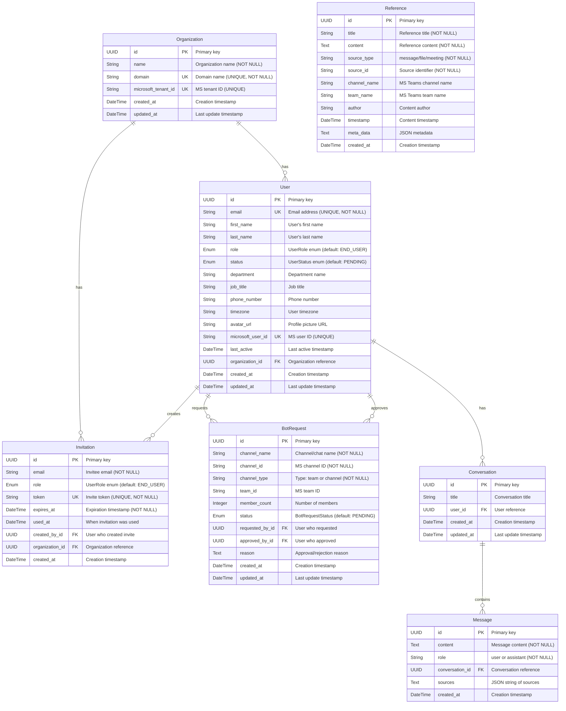

# Nexus Platform Database Schema

## Entity Relationship Diagram

## Database Schema Details

### 1. **Organization Table**
Stores information about organizations using the Nexus platform.

| Field | Type | Constraints | Description |
|-------|------|-------------|-------------|
| id | UUID | PRIMARY KEY | Unique identifier for the organization |
| name | String | NOT NULL | Organization's display name |
| domain | String | UNIQUE, NOT NULL | Email domain (e.g., acmecorp.com) |
| microsoft_tenant_id | String | UNIQUE | Microsoft Azure AD tenant ID |
| created_at | DateTime | DEFAULT: current time | When the organization was created |
| updated_at | DateTime | AUTO UPDATE | Last modification timestamp |

**Relationships:**
- One-to-Many with Users
- One-to-Many with Invitations

### 2. **User Table**
Stores all user information for both admins and end-users.

| Field | Type | Constraints | Description |
|-------|------|-------------|-------------|
| id | UUID | PRIMARY KEY | Unique identifier for the user |
| email | String | UNIQUE, NOT NULL | User's email address |
| first_name | String | NULLABLE | User's first name |
| last_name | String | NULLABLE | User's last name |
| role | Enum | DEFAULT: END_USER | UserRole: SUPER_ADMIN, ORG_ADMIN, TEAM_LEAD, END_USER |
| status | Enum | DEFAULT: PENDING | UserStatus: ACTIVE, PENDING, INACTIVE |
| department | String | NULLABLE | Department name |
| job_title | String | NULLABLE | Job title |
| phone_number | String | NULLABLE | Contact number |
| timezone | String | NULLABLE | User's timezone |
| avatar_url | String | NULLABLE | Profile picture URL |
| microsoft_user_id | String | UNIQUE | Microsoft user identifier |
| last_active | DateTime | NULLABLE | Last activity timestamp |
| organization_id | UUID | FOREIGN KEY | References Organization.id |
| created_at | DateTime | DEFAULT: current time | Account creation timestamp |
| updated_at | DateTime | AUTO UPDATE | Last modification timestamp |

**Relationships:**
- Many-to-One with Organization
- One-to-Many with Conversations
- One-to-Many with BotRequests (as requester and approver)
- One-to-Many with Invitations (as creator)

### 3. **Invitation Table**
Manages user invitations to join the platform.

| Field | Type | Constraints | Description |
|-------|------|-------------|-------------|
| id | UUID | PRIMARY KEY | Unique identifier |
| email | String | NOT NULL | Invitee's email address |
| role | Enum | DEFAULT: END_USER | Assigned role for new user |
| token | String | UNIQUE, NOT NULL | Secure invitation token |
| expires_at | DateTime | NOT NULL | Invitation expiration time |
| used_at | DateTime | NULLABLE | When invitation was accepted |
| created_by_id | UUID | FOREIGN KEY | References User.id |
| organization_id | UUID | FOREIGN KEY | References Organization.id |
| created_at | DateTime | DEFAULT: current time | When invitation was created |

**Relationships:**
- Many-to-One with Organization
- Many-to-One with User (creator)

### 4. **BotRequest Table**
Tracks requests to add Nexus bot to Teams channels/chats.

| Field | Type | Constraints | Description |
|-------|------|-------------|-------------|
| id | UUID | PRIMARY KEY | Unique identifier |
| channel_name | String | NOT NULL | Teams channel/chat name |
| channel_id | String | NOT NULL | Microsoft Teams channel ID |
| channel_type | String | NOT NULL | Type: "team" or "channel" |
| team_id | String | NULLABLE | Microsoft Teams team ID |
| member_count | Integer | NULLABLE | Number of members in channel |
| status | Enum | DEFAULT: PENDING | BotRequestStatus: PENDING, APPROVED, REJECTED |
| requested_by_id | UUID | FOREIGN KEY | References User.id |
| approved_by_id | UUID | FOREIGN KEY | References User.id |
| reason | Text | NULLABLE | Approval/rejection reason |
| created_at | DateTime | DEFAULT: current time | Request creation time |
| updated_at | DateTime | AUTO UPDATE | Last status update |

**Relationships:**
- Many-to-One with User (requester)
- Many-to-One with User (approver)

### 5. **Conversation Table**
Stores chat conversations between users and the Nexus bot.

| Field | Type | Constraints | Description |
|-------|------|-------------|-------------|
| id | UUID | PRIMARY KEY | Unique identifier |
| title | String | NULLABLE | Conversation title/summary |
| user_id | UUID | FOREIGN KEY | References User.id |
| created_at | DateTime | DEFAULT: current time | When conversation started |
| updated_at | DateTime | AUTO UPDATE | Last message timestamp |

**Relationships:**
- Many-to-One with User
- One-to-Many with Messages

### 6. **Message Table**
Stores individual messages within conversations.

| Field | Type | Constraints | Description |
|-------|------|-------------|-------------|
| id | UUID | PRIMARY KEY | Unique identifier |
| content | Text | NOT NULL | Message text content |
| role | String | NOT NULL | "user" or "assistant" |
| conversation_id | UUID | FOREIGN KEY | References Conversation.id |
| sources | Text | NULLABLE | JSON array of source references |
| created_at | DateTime | DEFAULT: current time | Message timestamp |

**Relationships:**
- Many-to-One with Conversation

### 7. **Reference Table**
Stores searchable content from Teams (messages, files, meetings).

| Field | Type | Constraints | Description |
|-------|------|-------------|-------------|
| id | UUID | PRIMARY KEY | Unique identifier |
| title | String | NOT NULL | Reference title/summary |
| content | Text | NOT NULL | Actual content text |
| source_type | String | NOT NULL | Type: "message", "file", "meeting" |
| source_id | String | NOT NULL | Original source identifier |
| channel_name | String | NULLABLE | Teams channel name |
| team_name | String | NULLABLE | Teams team name |
| author | String | NULLABLE | Content author name |
| timestamp | DateTime | NULLABLE | Original content timestamp |
| meta_data | Text | NULLABLE | JSON metadata (URLs, etc.) |
| created_at | DateTime | DEFAULT: current time | When indexed |

## Key Design Decisions

1. **UUID Primary Keys**: All tables use UUIDs for primary keys to ensure global uniqueness and avoid conflicts during data synchronization.

2. **Soft vs Hard Deletes**: The schema doesn't include soft delete flags, suggesting hard deletes are used. Consider adding `deleted_at` fields for audit trails.

3. **JSON Fields**: `sources` in Message and `meta_data` in Reference use JSON strings for flexible data storage.

4. **Enum Types**: Role and status fields use enums for data integrity:
   - UserRole: SUPER_ADMIN, ORG_ADMIN, TEAM_LEAD, END_USER
   - UserStatus: ACTIVE, PENDING, INACTIVE
   - BotRequestStatus: PENDING, APPROVED, REJECTED

5. **Audit Fields**: Most tables include `created_at` and `updated_at` for tracking changes.

6. **Microsoft Integration**: Dedicated fields for Microsoft IDs ensure proper integration with Teams/Azure AD.

## Security Considerations

1. **Token Security**: Invitation tokens should be cryptographically secure random strings.
2. **Role-Based Access**: UserRole enum enforces proper permission hierarchy.
3. **Organization Isolation**: All queries should filter by organization_id to prevent data leaks.
4. **Sensitive Data**: No passwords stored (relies on Microsoft OAuth).

## Performance Considerations

1. **Indexes**: Consider adding indexes on:
   - User.email, User.microsoft_user_id
   - Organization.domain
   - BotRequest.status
   - Reference content for full-text search

2. **Partitioning**: Reference table may grow large and benefit from partitioning by created_at.

3. **Archival**: Old conversations and messages may need archival strategy.